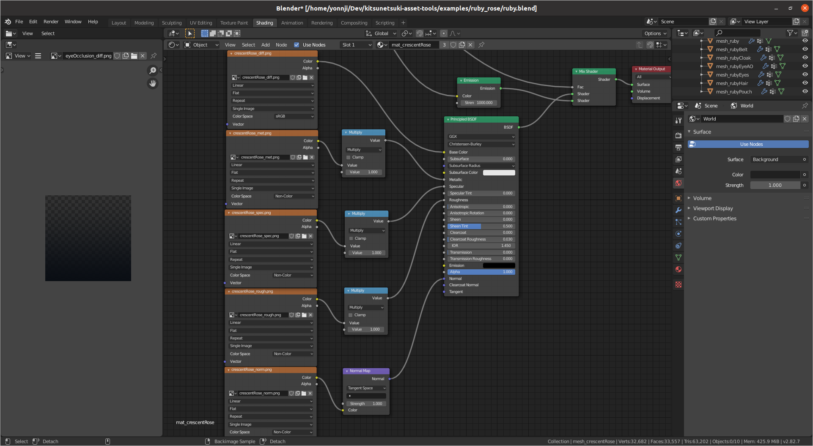
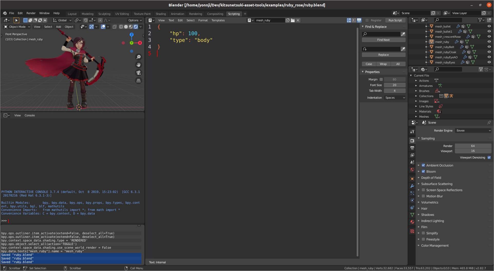

KITSUNETSUKI Asset Tools
========================

Collection of asset tools designed for automated pipeline.


Installation
------------

```
pip install .
```


Using examples
--------------

The model included is not made by myself.
The model was made by theStoff - https://sketchfab.com/3d-models/ruby-rose-2270ee59d38e409491a76451f6c6ef80

Convert models from BLEND file:
```
make -C examples/ruby_rose
```

Open converted models using Panda3D and RenderPipeline (from EGG format):
```
python examples/ruby_rose/scene_rp_egg.py
```

Open converted models using Panda3D and RenderPipeline (from glTF format):
```
python examples/ruby_rose/scene_rp_gltf.py
```


Expected material nodes setup
-----------------------------

Supported texture maps as BSDF inputs for RenderPipeline materials:
* Base Color
* Specular
* Roughness
* Normal Map

Supported BSDF input values as RenderPipeline material params:
* Metallic (RenderPipeline uses values 0 and 1 only)
* Roughness
* Normal Map Strength (from Normal Map Node)

Some input values could be specified as separate Math Nodes.





NodePath tags setup
-------------------

You can define object's tags using json-encoded Blender text blocks with the same name as an object.



pview output (notice the "hp" and "type" tags):
```
GeomNode mesh_ruby (1 geoms: S:(MaterialAttrib TextureAttrib)) [hp type] T:m(scale 10000)
```

python usage example:
```
ruby_mesh = self.ruby.find('**/=type=body')
print('hp', ruby_mesh.get_tag('hp'))
```
outputs:
```
hp 100
```

blend2egg
---------

BLEND to EGG (Panda3D model format) converter.

Features:
* Export [RenderPipeline](https://github.com/tobspr/RenderPipeline) materials
* Export Blender-calculated tangents-bitangents
* Export NodePath "tags" from json-encoded Blender text blocks
* Skeletal animations

EGG export requirements:
* Panda3D (1.10.6+) for EGG generation
* python-blender (2.81+) (Blender as Python module) or preinstalled Blender using the same path as Panda3D

Usage:
```
blend2egg --output x.egg x.blend
```


blend2gltf
----------

BLEND to [glTF](https://github.com/KhronosGroup/glTF) converter.
Uses custom glTF properties and extensions targeting [Panda3D glTF loader](https://github.com/Moguri/panda3d-gltf).

Features:
* Export [RenderPipeline](https://github.com/tobspr/RenderPipeline) materials
* Export Blender-calculated tangents-bitangents
* Export NodePath "tags" from json-encoded Blender text blocks

It's still in experimental state, so some features are still broken:
* Can't export animations
* Can't export specular map

glTF export requirements:
* python-blender (2.81+) (Blender as Python module) or preinstalled Blender using the same path as Panda3D

glTF loading requirements:
* panda3d-gltf (0.7+)

Usage:
```
blend2egg --output x.gltf x.blend
```
